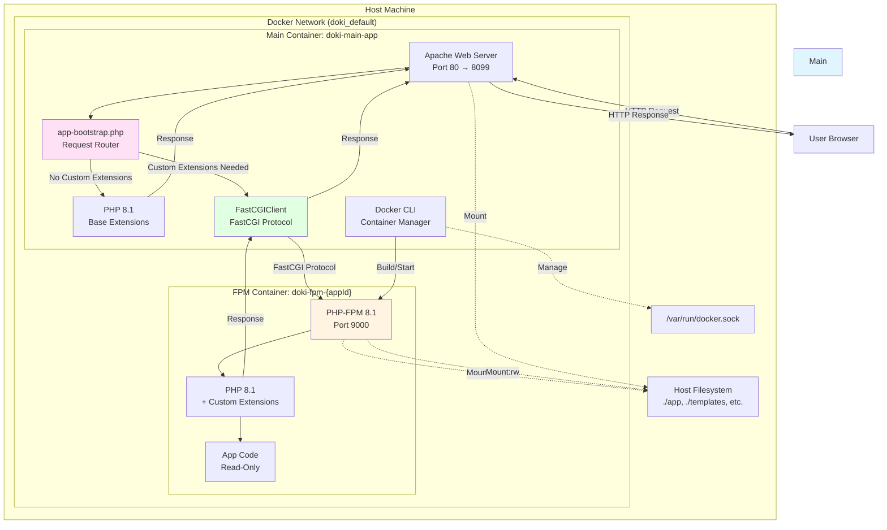
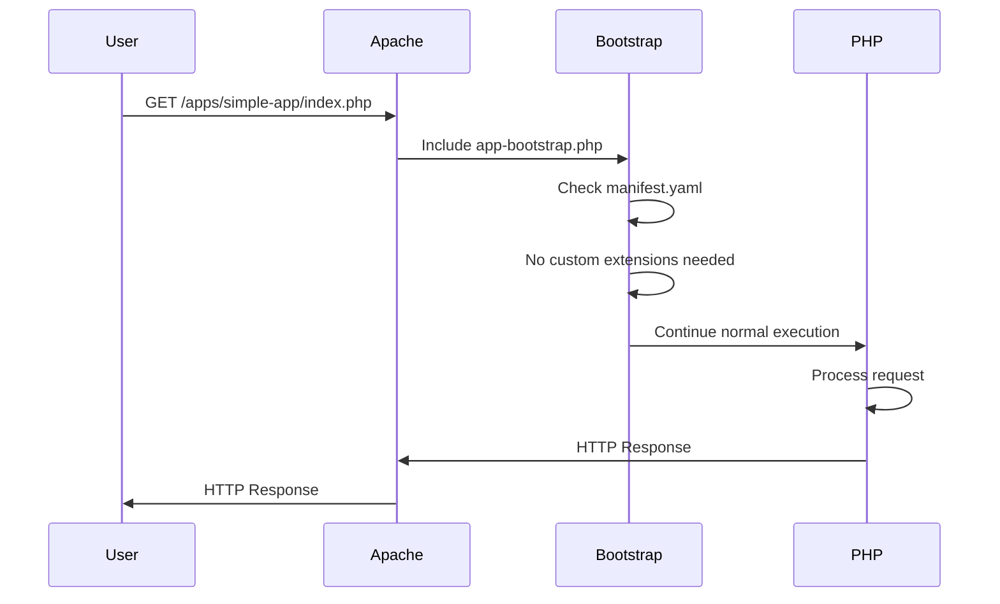
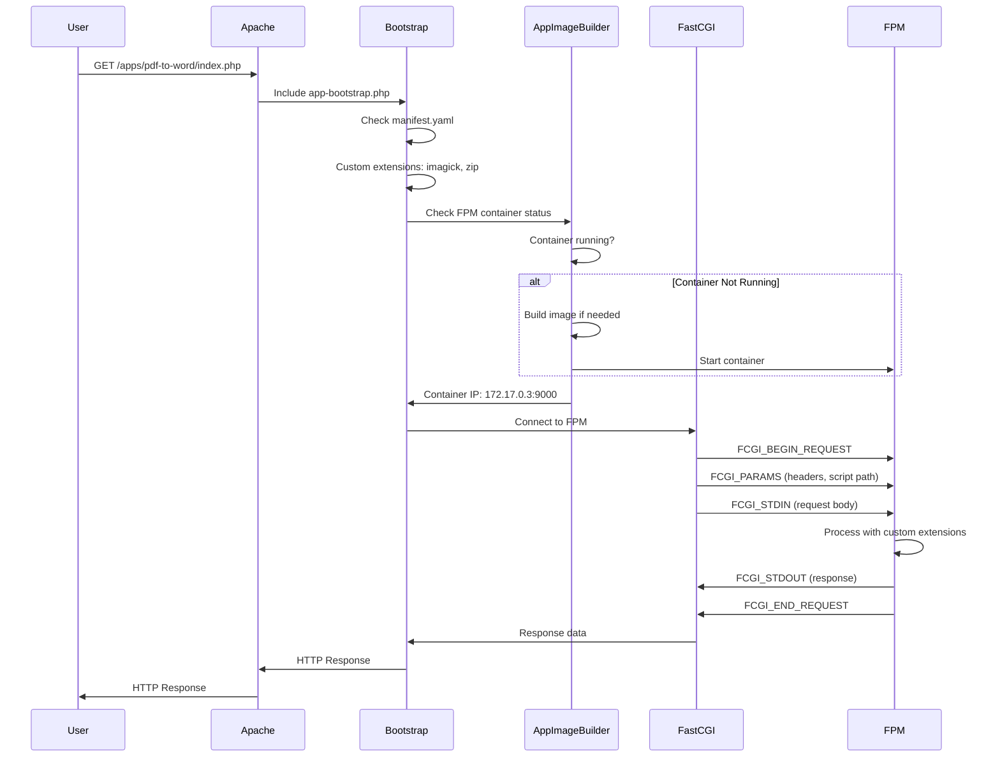
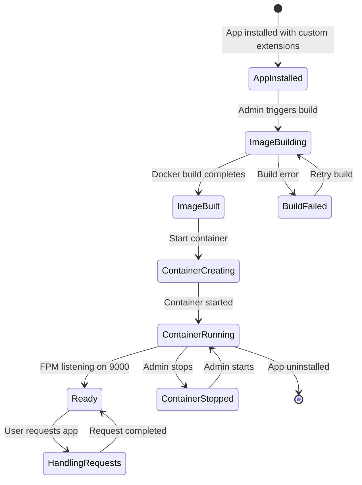
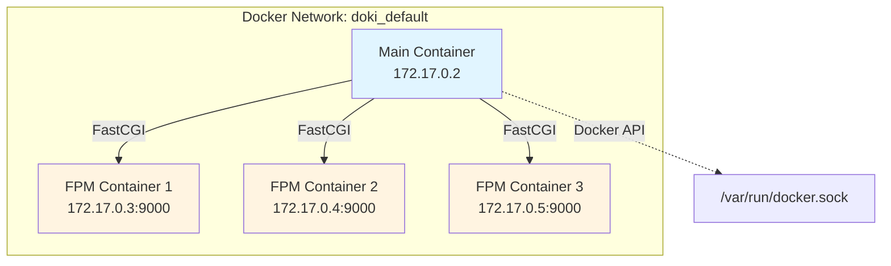
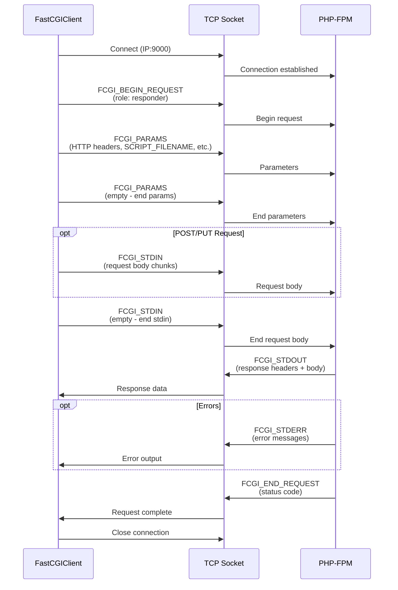
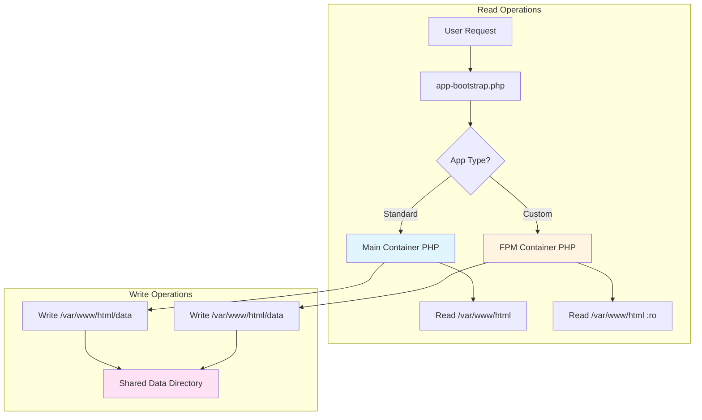
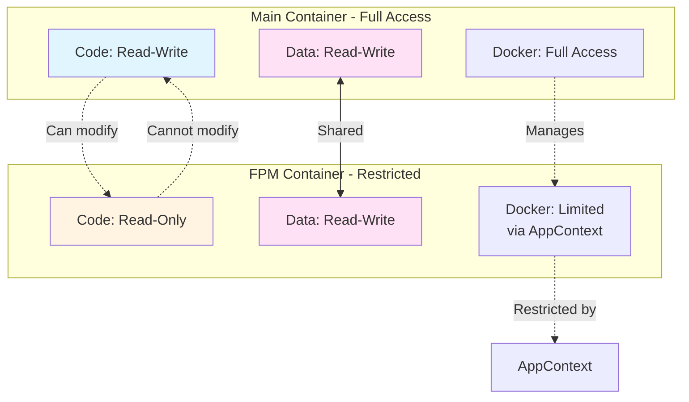
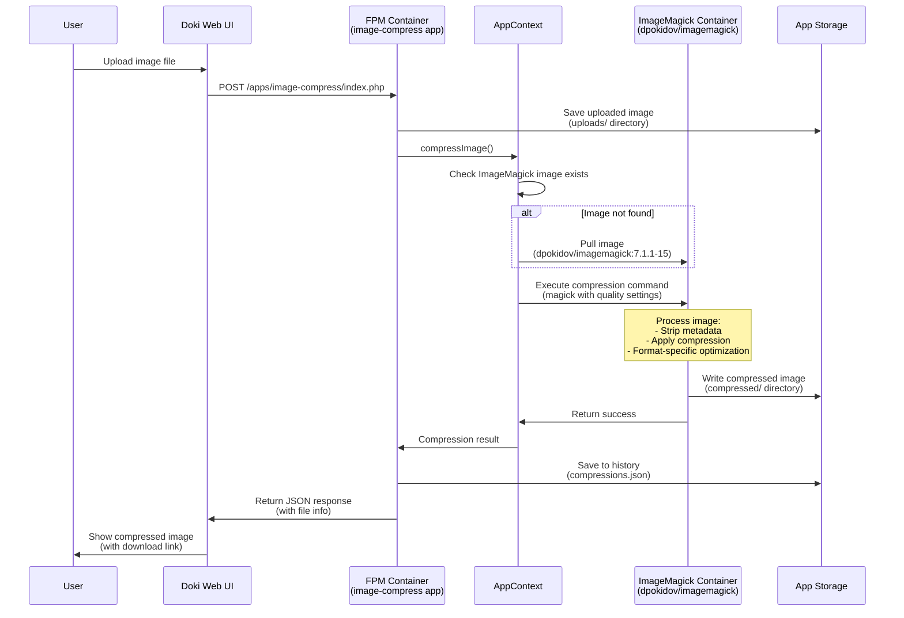
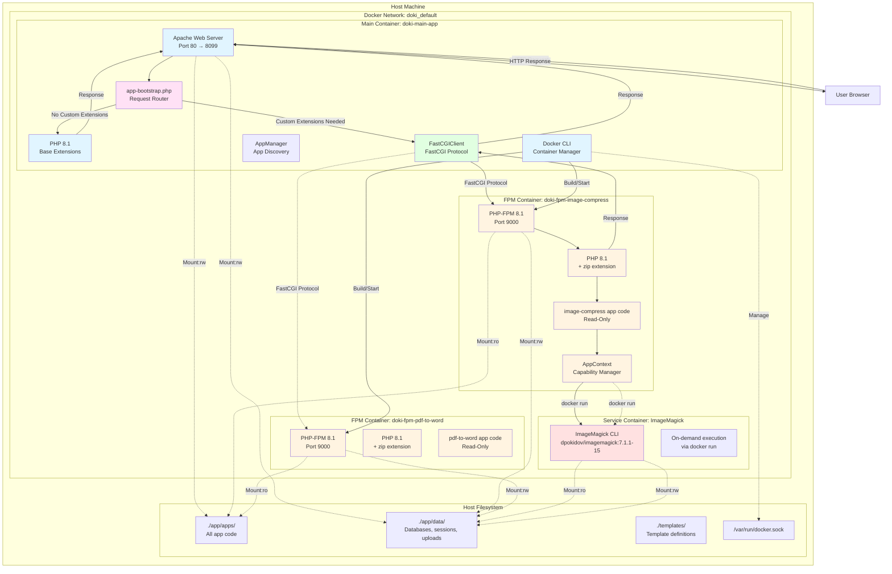

# Doki Runtime Architecture Diagram

## System Architecture Overview



## Request Flow: App Without Custom Extensions



## Request Flow: App With Custom Extensions



## Container Lifecycle



## Volume Mounts Architecture

```mermaid
graph LR
    subgraph "Host Filesystem"
        AppCode[./app/<br/>All app code]
        AppData[./app/data/<br/>Databases, sessions, uploads]
        Templates[./templates/<br/>Template definitions]
    end
    
    subgraph "Main Container"
        MC_AppCode[/var/www/html<br/>Read-Write]
        MC_Data[/var/www/html/data<br/>Read-Write]
        MC_Templates[/var/www/templates<br/>Read-Only]
    end
    
    subgraph "FPM Container"
        FPM_AppCode[/var/www/html<br/>Read-Only]
        FPM_Data[/var/www/html/data<br/>Read-Write]
    end
    
    AppCode -->|:rw| MC_AppCode
    AppData -->|:rw| MC_Data
    Templates -->|:ro| MC_Templates
    
    AppCode -->|:ro| FPM_AppCode
    AppData -->|:rw| FPM_Data
    
    style MC_AppCode fill:#e1f5ff
    style FPM_AppCode fill:#fff4e1
    style MC_Data fill:#ffe1f5
    style FPM_Data fill:#ffe1f5
```

## Network Communication



## FastCGI Protocol Flow



## AppImageBuilder Process

```mermaid
flowchart TD
    Start[App Requires Custom Runtime] --> CheckManifest{Read manifest.yaml}
    CheckManifest --> HasExtensions{Has phpExtensions?}
    HasExtensions -->|No| NoCustom[No custom image needed]
    HasExtensions -->|Yes| GenerateDockerfile[Generate Dockerfile]
    
    GenerateDockerfile --> ReadTemplate[Read Dockerfile.template]
    ReadTemplate --> ResolveDeps[Resolve extension dependencies]
    ResolveDeps --> AddSystemPackages[Add system package installs]
    AddSystemPackages --> AddExtensions[Add PHP extension installs]
    AddExtensions --> ReplacePlaceholder[Replace {{CUSTOM_EXTENSIONS}}]
    
    ReplacePlaceholder --> BuildImage[Build Docker Image]
    BuildImage --> ImageExists{Image exists?}
    ImageExists -->|Yes| CheckContainer{Container exists?}
    ImageExists -->|No| BuildError[Build failed]
    
    CheckContainer -->|Yes| StartContainer[Start existing container]
    CheckContainer -->|No| CreateContainer[Create new container]
    
    CreateContainer --> MountVolumes[Mount volumes:<br/>- Code :ro<br/>- Data :rw<br/>- Docker socket]
    MountVolumes --> SetNetwork[Connect to Doki network]
    SetNetwork --> StartContainer
    
    StartContainer --> WaitReady[Wait for FPM ready]
    WaitReady --> GetIP[Get container IP]
    GetIP --> Ready[Container ready on IP:9000]
    
    style Start fill:#e1f5ff
    style Ready fill:#e1ffe1
    style BuildError fill:#ffe1e1
```

## Component Interaction Matrix

| Component | Interacts With | Protocol/Mechanism | Purpose |
|-----------|---------------|-------------------|---------|
| Apache | User | HTTP/HTTPS | Web server |
| app-bootstrap.php | manifest.yaml | File read | Detect runtime requirements |
| app-bootstrap.php | AppImageBuilder | PHP class | Check container status |
| app-bootstrap.php | FastCGIClient | PHP class | Proxy requests |
| FastCGIClient | FPM Container | FastCGI Protocol | Execute PHP in FPM |
| AppImageBuilder | Docker CLI | Shell commands | Build images, manage containers |
| AppImageBuilder | Dockerfile.template | File read | Generate Dockerfile |
| FPM Container | Main Container | FastCGI | Receive proxied requests |
| FPM Container | Host Filesystem | Volume mounts | Access code and data |
| Main Container | Host Filesystem | Volume mounts | Access all files |
| Both Containers | Docker Socket | Unix socket | Docker operations |

## Data Flow: File Access



## Security Boundaries



## Image Compression App Flow



## Architecture Map: Container Boundaries


